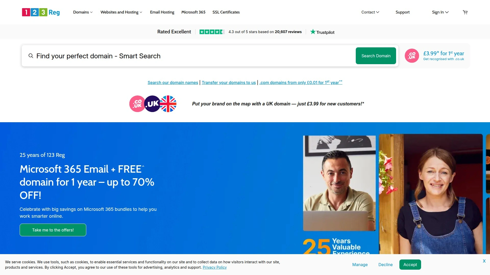
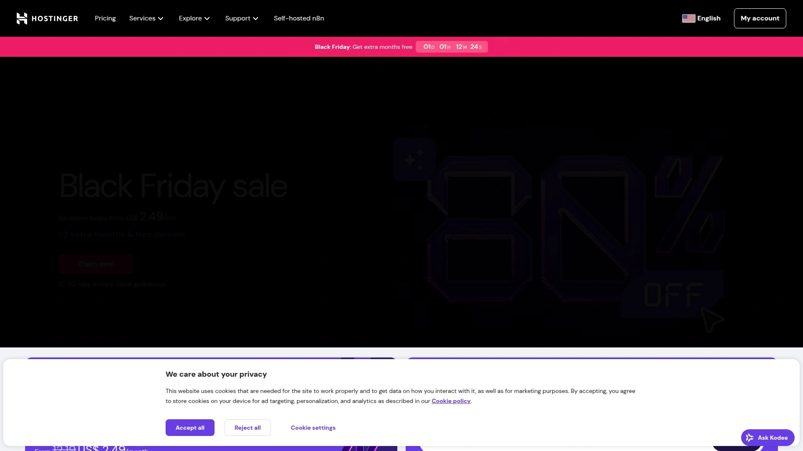

# Latest Domain Registration and Web Hosting Roundup (Including Performance Comparisons)

Traditional domain registrars charge renewal fees four times higher than first-year rates, hide essential features behind paywalls, and make transferring domains out feel like escaping a maze designed by someone who hates you. Modern domain registration and web hosting providers eliminate those frustrations by offering transparent pricing, bundled services that actually work together, and management dashboards you can navigate without a computer science degree.

The best domain registrars and web hosting companies combine competitive domain prices with reliable uptime guarantees above 99.9%, straightforward control panels, and support teams available when you need them rather than banking hours only.

---

## **[123 Reg](https://123-reg.co.uk)**

UK's largest domain registrar managing over 3.5 million domains with 25 years of expertise.

123 Reg built its reputation starting in 2000 as Britain's go-to domain registrar before expanding into comprehensive web hosting services trusted by over 800,000 customers running nearly 800,000 active websites. The company manages over 3.5 million registered domains and holds ICANN accreditation, ensuring reliability and security backed by proper industry credentials rather than fly-by-night operations that disappear when problems arise.

You get access to hundreds of domain extensions beyond standard .com and .org options—specialty extensions like .uk, .xyz, .club, and region-specific TLDs that help businesses choose names fitting their brand perfectly. The easy-to-use domain search tool finds affordable options quickly, with attractive first-time buyer discounts making initial registration accessible even on tight budgets. Domain registration from 1p for the first year on certain extensions removes financial barriers to getting started online.

**Comprehensive hosting solutions complement domain services seamlessly.** Shared hosting plans start at £2.99 monthly including one free domain for the first year, a single site, 100GB storage, unlimited bandwidth, 10 MySQL databases, and one-click installation for over 120 apps. Pro and Ultimate tiers provide significantly more resources if you need room to grow. WordPress-optimized hosting, VPS solutions, and dedicated servers accommodate businesses at every stage from startup to enterprise scale.

The platform includes email hosting with business-grade solutions, SSL certificates for security, website builder tools requiring zero coding skills, SEO utilities for improving search rankings, and marketing tools like ad builders. Everything you need to build, launch, and grow your online presence lives under one roof rather than forcing you to cobble together services from multiple vendors who don't integrate properly. State-of-the-art UK-based data centers powered by low-energy systems demonstrate the eco-friendly approach that helps protect the environment while cutting operational costs.

Support resources include helpful videos, detailed articles guiding you through registration and setup processes, plus 24/7 customer support teams available whenever questions arise. The straightforward three-color website design and intuitive navigation promise an easygoing user experience even for complete beginners. 123 Reg's philosophy remains simple: the internet is for the many, not the few, which explains why every product gets designed for small business owners looking for easy, hassle-free ways of getting online.

***

## **[GoDaddy](https://www.godaddy.com)**

World's largest domain registrar with 81 million domains under management.

GoDaddy dominates the domain registration industry by managing over 81 million domains worldwide—more than any other registrar by substantial margins. This massive scale brings infrastructure stability, extensive resources, and brand recognition that inspires confidence when choosing where to register your critical business assets. Founded decades ago, GoDaddy evolved from pure domain registration into comprehensive web services covering hosting, email, marketing tools, website builders, and payment processing.

The approachability stands out immediately—new users get presentable sites live quickly through guided setup processes and friendly interfaces that stay manageable as you add products or services. One-click WordPress installation works flawlessly, and the included site builder requires no technical knowledge whatsoever. Automated daily backups on most hosting tiers protect your work automatically without manual intervention, eliminating the anxiety of losing everything to a server failure or hack.

Global data centers strategically positioned worldwide improve load times for international audiences regardless of visitor location. Built-in payment acceptance through GoDaddy Payments keeps financial processing integrated directly into your site rather than forcing third-party payment gateway coordination. DNS management, email hosting, builders, and payments all operate under one roof, reducing the complexity that comes from managing services across multiple providers with different logins and support channels.

Customer support accessibility differentiates GoDaddy from budget competitors—24/7 phone support means you can actually speak with humans when problems strike, not just exchange chat messages or wait days for ticket responses. The knowledge base includes extensive documentation, video tutorials, and community forums where users help each other solve common issues. Competitive introductory promos on many plans make getting started affordable, though renewal rates climb to market averages after promotional periods expire.

The 99.9% uptime commitment backed by service level agreements provides recourse when availability drops below acceptable levels. Security features include SSL certificates, malware scanning, and DDoS protection on higher-tier plans. While GoDaddy charges more than bare-bones registrars, the comprehensive tooling, phone support, and proven reliability justify the premium for businesses prioritizing convenience and established infrastructure over absolute minimum cost.

***

## **[Namecheap](https://www.namecheap.com)**

Best value domain registrar with free WHOIS privacy and transparent pricing.

Namecheap emerged as the cost-conscious alternative to expensive incumbents by offering domain registration at genuinely affordable rates without deceptive renewal pricing that triples costs after year one. The platform includes WhoisGuard privacy protection completely free, eliminating the extra fees other registrars charge to keep your personal information hidden from public WHOIS databases. This privacy inclusion saves money while protecting you from spam, identity theft, and unwanted solicitation that follows public domain registrations.

Transparent renewal rates eliminate the sticker shock common with competitors advertising $0.99 first-year domains that renew at $15+ annually. Namecheap shows both promotional and standard pricing upfront, letting you calculate actual long-term costs before purchasing rather than discovering inflated renewals later. This honest approach builds trust and makes financial planning straightforward when managing domain portfolios of any size.

Beyond registration, Namecheap provides comprehensive hosting solutions including shared hosting, WordPress-optimized plans, VPS servers, and dedicated hosting for sites requiring serious resources. Shared hosting starts remarkably affordable with 20GB SSD storage, support for three websites, free domain for the first year, free SSL certificates, and 24/7 live chat support. The 30-day money-back guarantee removes risk from trying their services.

**Performance metrics demonstrate solid reliability.** Independent testing shows 99.99% uptime and sub-second load times competitive with premium providers costing significantly more. The cPanel access gives experienced users full control over hosting configuration, while the WordPress-friendly management tools simplify common tasks for less technical site owners. Site migration assistance helps transfer existing websites from current hosts without downtime or data loss headaches.

The downsides remain minimal—phone support isn't available, meaning you're limited to chat and tickets for assistance. However, the 24/7 chat teams respond quickly with helpful solutions rather than scripted brush-offs. For users prioritizing affordability without sacrificing essential features or reliability, Namecheap delivers exceptional value. The platform particularly suits budget-conscious individuals, freelancers, small businesses, and anyone managing multiple domains who appreciates predictable costs over flashy marketing.

***

## **[Hostinger](https://www.hostinger.com)**

Fastest-growing web host with domain registration from $0.99 and 7 million domains managed.

Hostinger combines affordable domain registration with innovative hosting tools that explain why it's currently the fastest-growing web host globally. Over 7 million domains registered through Hostinger benefit from instant activation, dedicated live support, and full DNS management included standard. Free domain registration comes bundled with annual hosting plans, eliminating the separate domain cost entirely when you sign up for web hosting services simultaneously.

Available free domains include .xyz, .com, .online, .link, .shop, .live, .digital, .tech, .space, .website, .email, and many others—giving you legitimate TLD options without paying anything beyond your hosting plan. After the first free year, only the domain renewal fee applies. This bundling approach saves money while simplifying management by keeping domains and hosting under one account rather than coordinating between separate providers.

The hosting infrastructure uses LiteSpeed web servers delivering 0.8 second average load times according to independent GTmetrix testing—among the fastest performance available at any price point. Unlimited bandwidth eliminates overage charges regardless of traffic spikes, and 99.9% uptime guarantees backed by SLAs ensure your site stays accessible. Data centers strategically positioned across the US, Europe, Asia, and South America let you choose server locations near your primary audience for optimal speed.

Hostinger's custom hPanel control panel simplifies website management compared to traditional cPanel interfaces that confuse beginners with overwhelming options. The one-click installer supports popular applications including WordPress, Joomla, Drupal, and over 100 others. AI website builder tools help non-technical users create professional sites through guided processes requiring no coding knowledge. Unlimited SSL certificates secure all your sites running HTTPS without additional purchases.

Pricing starts incredibly low—shared hosting from $1.99 monthly on promotional rates—making professional web hosting accessible to anyone with even minimal budgets. Business email hosting solutions with generous storage and premium features integrate seamlessly with your domains. The support team operates 24/7 through live chat with consistently high satisfaction ratings. Hostinger particularly suits beginners, small businesses, and anyone wanting maximum value without complexity or hidden fees inflating costs unpredictably.

***

## **[Bluehost](https://www.bluehost.com)**

WordPress.org recommended host with 2 million websites and seamless WP integration.

Bluehost powers over 2 million websites worldwide and holds the distinction of being officially recommended by WordPress.org itself—the ultimate endorsement for WordPress hosting quality. This recommendation stems from Bluehost's seamless WordPress integration that makes setting up WP sites completely effortless even for users who've never touched content management systems before. One-click WordPress installation works flawlessly, and the interface stays intuitive whether you're managing one blog or dozens of client sites.

Multiple hosting types accommodate different needs and growth stages. Shared hosting starts at $3.99 monthly for 36-month terms, providing budget-level entry points for new sites. WordPress-specific hosting optimizes performance and security specifically for WP installations. VPS hosting delivers dedicated resources for sites outgrowing shared environments. Dedicated servers provide enterprise-grade infrastructure for high-traffic operations requiring maximum control and performance.

**Feature richness justifies the higher pricing compared to ultra-budget hosts.** Plans include unmetered bandwidth eliminating overage worries, free domains for the first year, comprehensive security features, automated backups, and cPanel access giving experienced users full server control. The in-house website builder provides everything needed in one place, and the combination with cPanel makes hosting management fairly convenient regardless of technical skill level.

The official WordPress recommendation carries significant weight—WordPress.org only endorses hosts meeting strict performance, security, and support standards. This vetting process filters out unreliable providers that damage WordPress's reputation through poor service. Bluehost's inclusion on this short list signals genuine quality rather than marketing hype, though recent performance testing shows uptime below the advertised 99.98% in real-world conditions.

Phone support availability 24/7 exceeds budget competitors offering only chat or email assistance. The knowledge base includes extensive documentation, video tutorials, and community forums. Security features cover basics well, though some advanced protections require additional purchases adding to base costs. The platform suits WordPress users specifically, small to medium businesses, bloggers, content creators, and anyone prioritizing ease of use with comprehensive features over absolute minimum pricing. Renewal rates climb after promotional periods end, so factor long-term costs into budget planning.

***

## **[SiteGround](https://www.siteground.com)**

Premium managed hosting on Google Cloud with free CDN and daily backups.

SiteGround builds hosting infrastructure on Google Cloud's powerful network, delivering exceptional speed and global reliability that budget hosts running ancient hardware simply can't match. This enterprise-grade foundation ensures fast load times regardless of visitor location—the included SiteGround CDN distributes content across multiple servers worldwide, making visitor geography irrelevant for performance. Even the basic StartUp plan includes free SSL certificates, daily automated backups, and the proprietary CDN.

Managed services differentiate SiteGround from bare-bones providers dumping you in cPanel without assistance. The support team handles server maintenance, security patches, performance optimization, and technical troubleshooting, letting you focus on business rather than sys admin tasks requiring specialized knowledge. Developer-friendly features include staging environments for testing changes safely, Git integration for version control, SSH access for command-line management, and support for advanced PHP versions.

The platform particularly excels at e-commerce hosting where performance and security directly impact revenue. Faster page loads increase conversion rates measurably—studies show every 100ms delay costs 1% of sales. SiteGround's optimization delivers sub-second load times globally, protecting your bottom line. Enhanced security with daily scans, automatic updates, and proactive monitoring prevents the breaches that destroy customer trust and trigger legal liabilities under data protection regulations.

Customer satisfaction consistently ranks at the top of hosting reviews—the support team actually solves problems rather than sending scripted responses that waste your time. Live chat and phone support operate 24/7 with short wait times and knowledgeable staff. The resource-rich knowledge base includes detailed guides, video tutorials, and developer documentation covering advanced topics.

Pricing sits above budget hosts but delivers value through performance, reliability, and support quality that justify the premium. Plans start around $80 monthly for cloud hosting, though shared hosting options cost significantly less. The main limitations include renewal rates that increase substantially after promotional periods and resource limits that may require upgrading to costlier cloud plans as sites grow. SiteGround suits serious businesses, e-commerce sites, high-traffic blogs, developers needing advanced tools, and anyone prioritizing quality over bargain-basement prices.

***

## **[IONOS](https://www.ionos.com)**

Europe's largest hosting provider with comprehensive packages and 99.9% uptime guarantee.

IONOS operates as Europe's largest hosting company with massive infrastructure supporting millions of customers worldwide. The German-based provider delivers comprehensive packages bundling domain registration, web hosting, email solutions, SSL certificates, and website builders into coordinated offerings that work together seamlessly. This integration eliminates the coordination headaches that come from piecing together services from multiple vendors with incompatible systems.

Domain registration includes hundreds of TLDs at competitive prices with clear renewal rates displayed upfront rather than hidden until checkout. The domain search tool suggests alternatives when your first choice isn't available, and bulk domain management features help users overseeing portfolios of multiple domains. Free WHOIS privacy protection on qualifying domains safeguards personal information from public databases without additional fees.

Web hosting infrastructure delivers 0.78 second average fully loaded times in independent GTmetrix testing—among the fastest speeds measured across all providers at any price point. The 100% uptime during testing periods and 99.9% uptime guarantee backed by service level agreements ensure your site stays accessible when visitors arrive. Data centers positioned strategically across the US and Europe let you select server locations optimizing performance for your primary audience geography.

Apache web servers power the infrastructure with generous storage capacities and bandwidth allocations preventing overage charges. Email hosting includes professional addresses matching your domain, spam filtering, mobile device sync, and generous mailbox storage. The website builder requires no technical skills whatsoever—drag-and-drop interfaces, professionally designed templates, and AI-powered tools help create attractive sites quickly without hiring developers or learning code.

Support operates through phone and email channels with multilingual staff accommodating international customers across different time zones. The knowledge base includes extensive documentation in multiple languages reflecting IONOS's European roots and global customer base. Pricing starts at $15 monthly for basic plans, positioning IONOS in the mid-tier range between budget hosts and premium providers. The platform suits small to medium businesses, European customers preferring local infrastructure, and anyone wanting bundled services managed through one provider rather than coordinating multiple vendors. The main drawback involves fewer North American data centers compared to US-based competitors, potentially affecting performance for primarily American audiences.

***

## **[Domain.com](https://www.domain.com)**

Best for long-term domain management with portfolio tools and bulk discounts.

Domain.com specializes in domain registration and management with tools specifically designed for users handling multiple domains simultaneously rather than casual site owners with single domains. The platform shines for domain investors, agencies managing client domains, businesses protecting brand variations, and anyone building domain portfolios requiring sophisticated organization and automation features unavailable in basic registrars.

Bulk registration discounts reduce per-domain costs significantly when purchasing multiple names simultaneously—crucial for protecting brand variations, defensive registrations preventing cybersquatters, and investment strategies involving portfolio acquisition. The bulk search tool processes hundreds of domain queries at once, quickly identifying available options matching your criteria. Bulk management features apply changes across multiple domains with single actions rather than tedious manual updates repeated individually.

Portfolio organization tools include tagging, categorization, advanced filtering, and custom folder structures that keep hundreds or thousands of domains manageable. Automated renewal settings prevent accidental lapses from forgotten payment deadlines that could cost valuable domains. Expiration monitoring alerts you well before domains approach renewal dates, giving adequate time to decide whether renewing or releasing each name. Transfer management simplifies moving domains between registrars or accounts with guided processes reducing errors.

**Competitive pricing on standard TLDs and specialty extensions.** Long-term registration periods up to 10 years lock prices today, protecting against future increases while ensuring continuous ownership without annual renewal hassle. Free WHOIS privacy protection on eligible domains maintains confidentiality without ongoing fees. DNS management provides full control over records with intuitive interfaces that don't require sys admin expertise.

Web hosting services complement domain registration though Domain.com's core strength remains domain management rather than hosting performance. Support operates 24/7 through chat and email with generally helpful responses, though phone support may be limited depending on plan level. The platform particularly suits domain investors, digital agencies, enterprises protecting trademarks across multiple TLDs, and experienced users wanting advanced portfolio management tools rather than hand-holding for basic registration tasks.

***

## **[OVH](https://www.ovh.com)**

French hosting giant with 800+ domain extensions and multilingual support.

OVH ranks among the world's largest hosting providers with European headquarters and truly global operations spanning six continents. The domain registrar claims access to over 800 domain extensions—one of the most extensive TLD libraries available anywhere. You can locate regional or country-specific domain extensions requiring verification that other registrars simply don't offer, making OVH invaluable for international businesses needing local domain presence across multiple markets.

Services included with domain purchases provide immediate value—free email addresses with 5GB storage let you start using professional email matching your domain immediately. Free WHOIS privacy protection hides personal information from public databases without additional fees. Free DNS from OVH secures all communications through your domain using their robust infrastructure. Optional DNS acceleration services speed up resolution times for a fee if milliseconds matter for your application.

**Exceptional international accessibility differentiates OVH from primarily English-language providers.** The website offers translations and currency conversions for countries worldwide—simply select your country to see pricing in local currency and navigate interfaces in your preferred language. This localization makes OVH uniquely accessible for non-English speakers and businesses operating in markets where English isn't the primary language, eliminating the friction that comes from navigating foreign-language interfaces and unclear currency conversions.

Beyond domains, OVH sells comprehensive services from shared hosting to dedicated servers with massive performance specifications. The hosting infrastructure uses enterprise-grade hardware and network connectivity typically reserved for significantly more expensive providers. Two-factor authentication strengthens account security, protecting valuable domain portfolios from unauthorized access that could lead to theft or hijacking.

Pricing appears reasonable across domain extensions with featured TLDs often carrying promotional rates. Support quality varies by region and language—European customers generally report better experiences than other markets, reflecting OVH's French origins and European focus. The platform particularly suits international businesses, European customers, users needing obscure country-code TLDs, multilingual operations, and anyone prioritizing extension variety over hand-holding beginner support.

***

## **[Enom](https://www.enom.com)**

Enterprise domain registrar since 1998 with 24/7 phone support.

Enom operates as an enterprise-focused domain registrar and hosting provider serving the industry since 1998—longevity that demonstrates stability and staying power in a market where providers frequently disappear. The platform handles domains, web security, websites, hosting, and email through one-stop-shop convenience that simplifies vendor management for businesses tired of coordinating multiple service providers.

Domain selection starts with a large search bar revealing regular extensions like .com and .org alongside featured options like .life and .today. Extensive filtering by location, profession, or educational background helps identify extensions that signal your specific market position or credentials. The domain library includes numerous unique extensions with some exclusive options for particular industries and geographies unavailable through consumer-oriented registrars.

Pricing runs higher than budget competitors—standard domains typically cost $13-$15 compared to sub-$10 offerings elsewhere. However, the premium includes 24/7 customer support availability with actual phone numbers you can call rather than being limited to chat or ticket systems. Speaking directly with knowledgeable humans often resolves complex issues faster than endless chat exchanges or days waiting for ticket responses. This accessibility matters for businesses where domain problems directly impact operations and revenue.

Each domain purchase includes support for free domain transfers simplifying moves from previous registrars. Options for WHOIS and trademark protection help secure your brand identity and personal information. The premium domain marketplace connects buyers with valuable domains selling for thousands of dollars, though most businesses should avoid these marked-up names when equally effective alternatives exist at standard registration costs.

Bulk domain search tools help users creating site networks or acquiring multiple domains protecting brand variations. Security services include SSL certificates, malware scanning, and DDoS mitigation for sites requiring robust protection. Two-factor authentication strengthens account security preventing unauthorized access. Enom particularly suits enterprise clients, agencies managing numerous client domains, businesses prioritizing phone support and established stability over rock-bottom prices, and users needing advanced services beyond basic registration. The higher costs get justified through better support accessibility and the comprehensive service ecosystem rather than pure domain registration pricing.

***

## **[Cloudflare Registrar](https://www.cloudflare.com)**

At-cost domain registration with no markup and integrated security services.

Cloudflare disrupted domain registration by selling domains at pure cost without markup—they literally charge only what ICANN and registries charge them, making Cloudflare consistently the cheapest registrar for any extension they support. This unprecedented pricing eliminates the profit margin other registrars build into every domain, passing 100% of cost savings directly to customers. For users managing large domain portfolios, this transparency saves thousands annually compared to traditional registrars.

The at-cost model works because Cloudflare profits from other services rather than domain registration itself. Their core business provides content delivery networks, DDoS protection, DNS services, and web security—domain registration serves as an entry point attracting customers to their broader platform. This strategy means Cloudflare has no incentive to hide fees, force upgrades, or inflate renewal costs since domains aren't their revenue source.

Integration with Cloudflare's security and performance services creates powerful synergies when you use multiple offerings together. Free SSL certificates, DDoS mitigation, CDN acceleration, and bot protection normally costing substantial fees become included at no charge. The DNS infrastructure ranks among the fastest globally with resolution times measured in single-digit milliseconds compared to competitors taking 20-100ms. This speed difference improves website performance measurably since DNS lookups happen before page loading even begins.

**The catch involves limited TLD support and bare-bones interfaces.** Cloudflare focuses on popular extensions rather than obscure TLDs, so specialty domains might not be available. The registration interface emphasizes functionality over flashy design—experienced users appreciate the efficiency while beginners might find it intimidating compared to guided consumer-oriented registrars. Email support handles questions adequately though response times can stretch longer than providers offering 24/7 phone accessibility.

Domain transfer requirements mandate existing Cloudflare accounts, meaning you need to start using their services before transferring domains in. However, the free tier includes generous allowances suitable for most small to medium sites, so this requirement rarely creates barriers. Cloudflare Registrar particularly suits technically proficient users, cost-conscious domain investors, businesses already using Cloudflare services, and anyone managing domain portfolios where per-domain savings compound significantly across multiple names.

***

## FAQ

**What's the real difference between domain registrars and why does choosing matter?**

Domain registrars all provide the same fundamental service—registering your desired name with ICANN—but pricing, renewal costs, added services, and support quality vary dramatically. Budget registrars advertise $0.99 first-year domains but charge $15+ renewals, while transparent providers like Cloudflare charge actual cost with zero markup. Some bundle free WHOIS privacy, SSL certificates, and email hosting while others nickel-and-dime every feature. Customer support ranges from 24/7 phone assistance to ticket-only systems taking days to respond. Choose based on long-term costs, bundled features you actually need, and support accessibility matching your technical skill level.

**Should I register domains and hosting with the same provider or keep them separate?**

Industry professionals typically recommend separating domain registration from hosting to maintain control and flexibility. If hosting problems arise or you want to switch providers, keeping domains elsewhere prevents the host from holding your domain hostage during disputes. However, bundling offers convenience through unified management dashboards and often includes first-year domain registration free with annual hosting plans. For beginners prioritizing simplicity over maximum control, bundling works fine initially. As your online presence grows more critical to business operations, consider moving domains to dedicated registrars like Namecheap or Cloudflare while keeping hosting separate.

**How do I evaluate whether web hosting performance claims match reality?**

Ignore marketing promises and check independent testing from sites like GTmetrix, Pingdom, and WebsiteP lanet that measure actual load times, uptime percentages, and server response speeds across multiple geographic locations. Look for hosting reviews publishing months of uptime data rather than week-long tests that might miss reliability problems. Server locations matter—hosts with data centers near your primary audience deliver faster speeds than distant servers. Free trials and money-back guarantees let you test performance firsthand before committing long-term. Measure your own site's load times after launching, and don't hesitate switching hosts if performance consistently disappoints.

---

## Conclusion

Choosing the right domain registrar and web hosting provider eliminates the renewal shock, hidden fees, and support nightmares that plague users stuck with predatory providers. These ten platforms deliver transparent pricing, reliable performance, and customer-friendly policies that actually work for you rather than extracting maximum fees through deceptive practices. [123 Reg](https://123-reg.co.uk) stands out for UK-based businesses wanting local infrastructure, 25 years of proven stability managing 3.5 million domains, and comprehensive bundles including domains, hosting, email, and website tools through one accessible platform optimized for British small business owners getting online without technical expertise or inflated costs.
